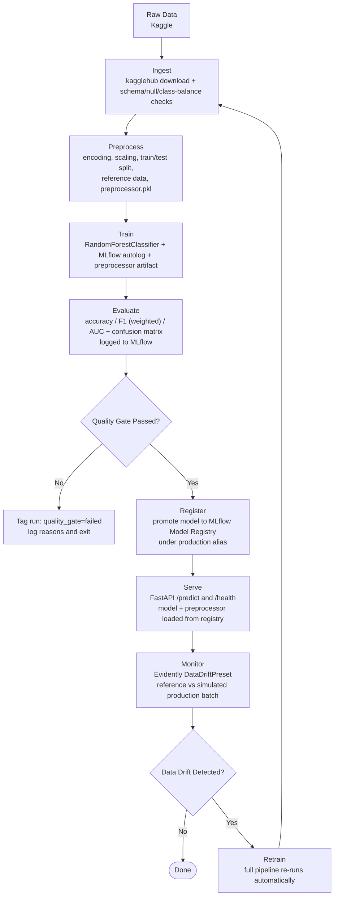
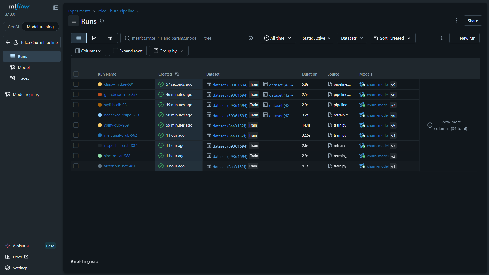
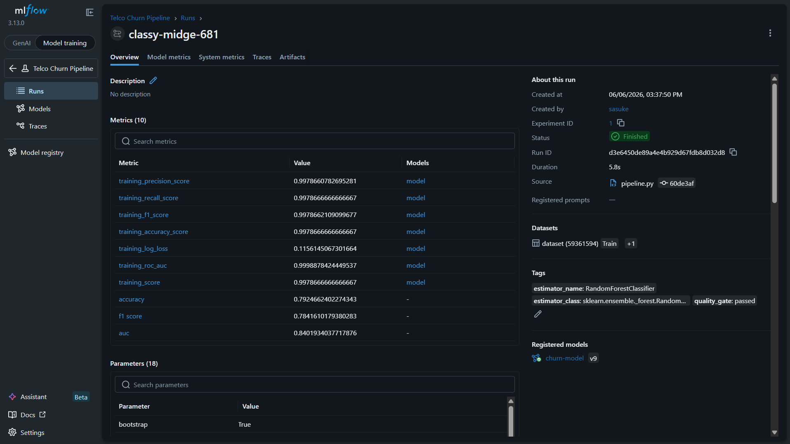
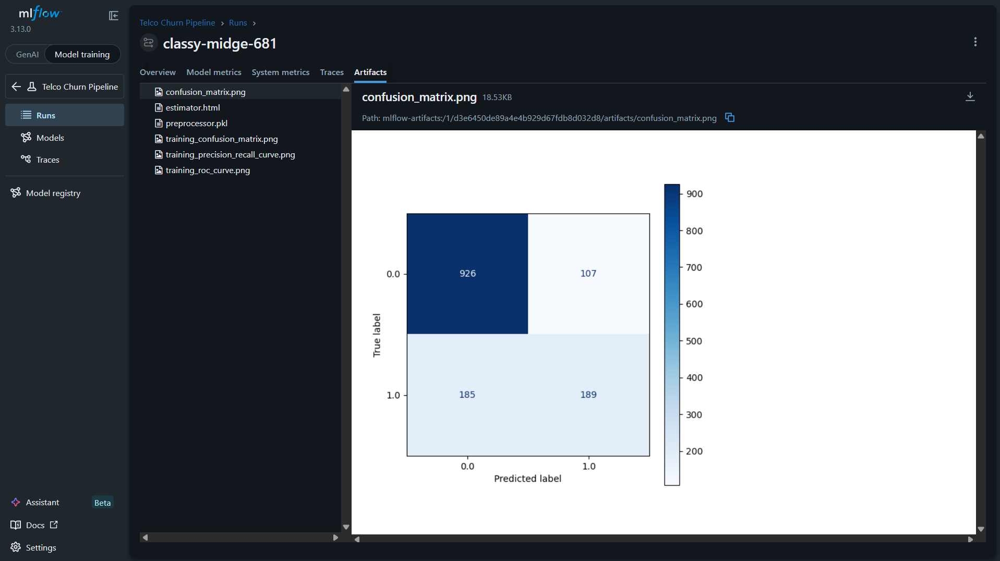
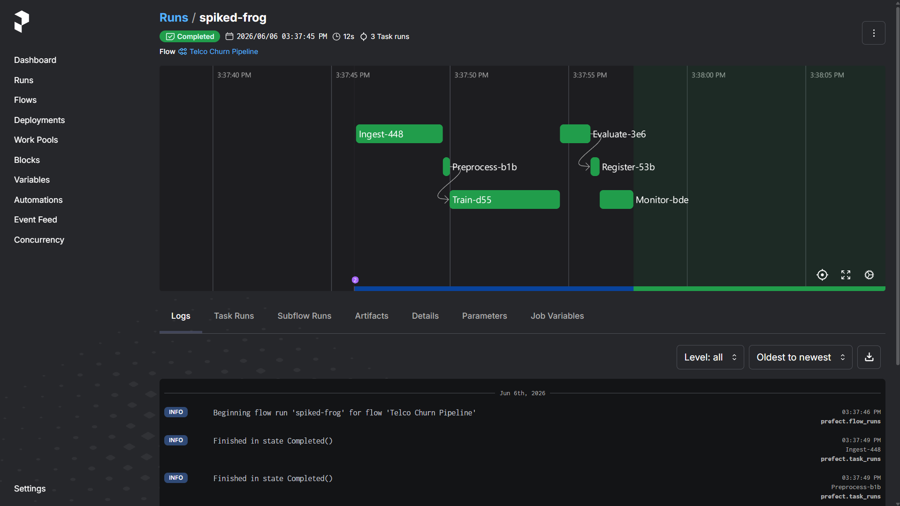

# Telco Churn MLOps Pipeline

A production-grade, end-to-end MLOps pipeline for predicting customer churn — built from scratch with real tooling used in industry.

Predicts whether a telecom customer will churn using a Random Forest classifier, served via a REST API, with automated drift detection and retraining. Every stage of the ML lifecycle is covered: data ingestion, preprocessing, training, evaluation, model registration, serving, monitoring, and automated retraining.

---

## Architecture



All steps are orchestrated as a Prefect flow with per-task logging, retries on flaky steps, and a visual run dashboard.

---

## Screenshots

| MLflow Runs | Run Overview |
| --- | --- |
|  |  |

| Confusion Matrix | Prefect Dashboard |
| --- | --- |
|  |  |

---

## Stack

| Layer | Tool |
|---|---|
| Data versioning | DVC |
| Experiment tracking | MLflow 3.x |
| Orchestration | Prefect |
| Serving | FastAPI + Uvicorn |
| Drift monitoring | Evidently AI (v0.7+) |
| Data | Kaggle — Telco Customer Churn (blastchar) |
| ML | scikit-learn 1.2.2 — RandomForestClassifier |
| Schema validation | Pydantic v2 |
| CI | GitHub Actions |
| Package management | uv |
| Python | 3.11 |

---

## Project Structure

```
telco-churn-pipeline/
│
├── data/
│   ├── raw/                    # Original Telco CSV (DVC tracked)
│   ├── processed/              # Encoded train/test splits (X_train, X_test, y_train, y_test)
│   └── reference/              # First 5000 raw rows — Evidently drift baseline
│
├── src/
│   ├── ingest.py               # Kaggle download + schema/null/class-balance validation
│   ├── preprocess.py           # Feature engineering, encoding, scaling, splitting
│   ├── train.py                # RF training, MLflow autolog, preprocessor artifact logging
│   ├── evaluate.py             # Test-set metrics, confusion matrix, quality gate
│   ├── register.py             # Promote best run to MLflow Model Registry
│   ├── monitor.py              # Evidently drift report generation
│   └── retrain_trigger.py      # Drift flag → full retrain orchestration
│
├── api/
│   ├── main.py                 # FastAPI app, lifespan model loading, /predict + /health
│   ├── predict.py              # ModelService — loads model + preprocessor from registry
│   └── schemas.py              # Pydantic CustomerFeatures request + PredictionResponse
│
├── flows/
│   └── pipeline.py             # Prefect @flow + @task wrappers for all src/ steps
│
├── monitoring/
│   └── reports/                # Evidently HTML drift reports (timestamped)
│
├── tests/
│   ├── test_preprocess.py      # Output shape + null checks, tmp_path patching
│   ├── test_predict.py         # FastAPI TestClient with mocked ModelService
│   └── test_drift.py           # Drift detection returns bool, mocked Evidently Report
│
├── .github/
│   └── workflows/
│       └── ci.yml              # GitHub Actions: uv sync + pytest on push to main
│
├── model/                      # Local preprocessor.pkl (also logged to MLflow)
├── pyproject.toml              # uv project config, pinned dependencies
└── README.md
```

---

## Quickstart

### Prerequisites

- Python 3.11
- [uv](https://github.com/astral-sh/uv)
- Kaggle API credentials at `~/.config/kaggle/kaggle.json`
- MLflow server running
- Prefect server running (optional — runs an ephemeral server otherwise)

### Setup

```bash
git clone https://github.com/ArceusOmkar7/telco-churn-pipeline
cd telco-churn-pipeline
uv sync
```

### Start MLflow

```bash
mlflow server --host 0.0.0.0 --port 5001
```

### Start Prefect (optional)

```bash
prefect server start

# point the client at your server (persists across sessions)
prefect config set PREFECT_API_URL=http://127.0.0.1:4200/api
```

### Run the full pipeline

```bash
uv run -m flows.pipeline
```

With drift monitoring + auto-retrain enabled:

```bash
# pass run_monitor=True in flows/pipeline.py __main__ block
uv run -m flows.pipeline
```

### Run individual steps

```bash
uv run src/ingest.py
uv run src/preprocess.py
uv run src/train.py
uv run src/evaluate.py
uv run src/register.py
uv run -m src.monitor
uv run -m src.retrain_trigger
```

### Serve the API

```bash
uvicorn api.main:app --host 0.0.0.0 --port 8000
```

Health check:

```bash
curl http://localhost:8000/health
# {"status": "ok"}
```

### Test a prediction

```bash
curl -X POST http://localhost:8000/predict \
  -H "Content-Type: application/json" \
  -d '{
    "gender": "Female",
    "SeniorCitizen": 0,
    "Partner": "Yes",
    "Dependents": "No",
    "tenure": 1,
    "PhoneService": "No",
    "MultipleLines": "No phone service",
    "InternetService": "DSL",
    "OnlineSecurity": "No",
    "OnlineBackup": "Yes",
    "DeviceProtection": "No",
    "TechSupport": "No",
    "StreamingTV": "No",
    "StreamingMovies": "No",
    "Contract": "Month-to-month",
    "PaperlessBilling": "Yes",
    "PaymentMethod": "Electronic check",
    "MonthlyCharges": 29.85,
    "TotalCharges": 29.85
  }'
```

Expected response (first row of dataset — high churn risk profile: new customer, month-to-month contract, electronic check):

```json
{
  "prediction": true,
  "probability": 0.79
}
```

---

## Tests

```bash
uv run -m pytest tests/ -v
```

3 tests, all fully mocked — no MLflow server, Kaggle credentials, or data/raw/ directory needed in CI.

| Test | What it checks |
|---|---|
| `test_preprocess_shapes_and_nulls` | 80/20 split output shapes, no NaN values in any split |
| `test_predict_endpoint` | /predict returns 200 + correct response schema |
| `test_drift_detection_returns_boolean` | report() returns a bool regardless of drift state |

Tests use `tmp_path` patching for filesystem isolation and `unittest.mock` for all external dependencies.

---

## Pipeline Details

### Data

- **Dataset**: [Telco Customer Churn](https://www.kaggle.com/datasets/blastchar/telco-customer-churn) — 7,043 rows, 21 columns, binary target (`Churn: Yes/No`)
- **Class balance**: ~73% No Churn / ~27% Churn — handled via weighted F1 scoring and stratified splits
- **Reference data**: first 5,000 rows saved as raw CSV — used as Evidently drift baseline
- **Production simulation**: rows 5,001–7,043 fed as incoming batch to simulate real production traffic

### Preprocessing

- `customerID` dropped — no predictive value
- `TotalCharges` coerced from string to float (raw CSV stores it as object) — 11 NaN records dropped
- `SeniorCitizen` treated as numerical (already 0/1 integer in raw data — was initially missed and silently dropped via `remainder="drop"`, fixed by adding to `numerical_columns`)
- Binary categoricals (`gender`, `Partner`, `Dependents`, `PhoneService`, `PaperlessBilling`) → `OrdinalEncoder`
- Multi-class categoricals (`MultipleLines`, `InternetService`, `OnlineSecurity`, etc.) → `OneHotEncoder`
- Numericals (`SeniorCitizen`, `tenure`, `MonthlyCharges`, `TotalCharges`) → `StandardScaler`
- Target (`Churn`) → `LabelEncoder`
- 80/20 stratified train/test split (random_state=420)
- Preprocessor serialized as `preprocessor.pkl`, saved locally and logged to MLflow as an artifact on the same run as the model

### Training

- `mlflow.sklearn.autolog()` handles hyperparameter logging, training metrics, feature importances, and model artifact automatically
- `preprocessor.pkl` logged manually via `mlflow.log_artifact()` inside the same `mlflow.start_run()` context
- Model artifact path: `runs:/{run_id}/model`
- Preprocessor artifact path: `runs:/{run_id}/preprocessor.pkl`

### Evaluate vs Train — separation of concerns

`train.py` logs training-time metadata. `evaluate.py` is a separate quality gate that:
- Loads the model from the latest MLflow run independently
- Computes metrics on the held-out test set
- Logs metrics + confusion matrix back to the same run using `mlflow.start_run(run_id=..., nested=True)`
- Tags the run `quality_gate: passed` or `quality_gate: failed` with failure reasons

This separation means CI/CD can call `evaluate.py` independently and get a clean pass/fail verdict without re-running training.

### Quality Gate

| Metric | Threshold |
|---|---|
| Accuracy | >= 0.70 |
| F1 (weighted) | >= 0.65 |
| AUC | >= 0.75 |

Weighted F1 used (not macro) to account for class imbalance. Failed runs are tagged and reasons logged as a comma-separated MLflow tag. Only passed runs proceed to registration.

### Model Registry

- Uses MLflow Model Registry with **aliases** (not stages — stages are deprecated since MLflow 2.9)
- Registered under name `churn-model` with alias `production`
- `register.py` reads the `quality_gate` tag from the run before registering — it trusts evaluate's verdict rather than re-running the gate
- Waits for `READY` status before transitioning to avoid race conditions on registration

### Serving

- FastAPI app uses the `lifespan` pattern (not deprecated `@app.on_event`) for startup model loading
- Model loaded via `models:/churn-model@production` URI
- Run ID extracted via `MlflowClient.get_model_version_by_alias()` to download `preprocessor.pkl` from the same run
- Preprocessor and model are always from the same training run — guaranteed consistency
- Pydantic v2 `CustomerFeatures` validates all 19 input fields with type constraints (`ge=0` on numeric fields)
- `/health` endpoint for liveness checks

### Drift Detection

- Evidently v0.7+ API: `Dataset.from_pandas()` + `DataDefinition` (replaces `ColumnMapping` from v0.6 and below)
- `DataDefinition` explicitly maps numerical and categorical columns — required to prevent Evidently from treating string categoricals as free text and running NLP-style drift tests (which crash on float values)
- `DataDriftPreset` computes per-column distribution shift
- Drift flag extracted from `DriftedColumnsCount` metric in result dict
- HTML report saved to `monitoring/reports/`
- If drift detected: `retrain_trigger.py` runs full `preprocess → train → evaluate → register` cycle

### Prefect Orchestration

- Each pipeline step is a `@task` wrapping the corresponding `src/` function — core logic has no Prefect dependency
- `ingest_task` has `retries=2, retry_delay_seconds=5` — Kaggle downloads can flake
- `pipeline()` is a `@flow` with a `run_monitor: bool` parameter — default run skips monitoring, pass `True` to enable drift check + conditional retrain
- Prefect UI available at `http://localhost:4200` when server is running

---

## CI

GitHub Actions runs on every push and pull request to `main`:
- Sets up Python 3.11 + uv
- `uv sync` installs all dependencies
- `pytest tests/ -v` runs all 3 tests

Tests are fully mocked so CI requires no external services (no MLflow, no Kaggle, no data files).

---

## Known Issues / Limitations

- MLflow autolog with `log_models=True` (default) saves the model under `models/m-xxx` in a separate artifact store path rather than `runs:/{run_id}/model`. This causes a warning during registration but does not affect functionality — the model is still registered and loadable.
- sklearn version mismatch: autolog compatibility warning for 1.2.2 vs 1.5.0+. Pinned to 1.2.2 for stability. Upgrading would require regenerating `preprocessor.pkl` with the new version.
- Static dataset used for drift simulation — in production this would be replaced with a live prediction log stream.
- `SeniorCitizen` was silently dropped in the initial preprocessing pass due to `remainder="drop"` in the `ColumnTransformer` — caught and fixed by explicitly adding it to `numerical_columns`.

---

## What I Learned

- **MLflow autolog vs manual log_model**: autolog saves models to a separate path under `models/` when `log_models=True`, which breaks `runs:/{run_id}/model` URIs. The fix is either `log_models=False` + manual `log_model(artifact_path="model")`, or accepting autolog's path and loading via the registry alias instead.
- **Module-level side effects**: `FILEPATH = next(Path(...).glob("*.csv"))` at import time crashes test collection when `data/raw/` doesn't exist. Lesson: module level is for definitions only — filesystem I/O belongs inside functions.
- **Evidently v0.7 breaking change**: `ColumnMapping` was removed. The new API requires wrapping DataFrames in `Dataset.from_pandas()` with a `DataDefinition` object. Without explicit column type mapping, Evidently treats string columns as free text and runs NLP drift tests that fail on numeric data.
- **MLflow registry stages deprecated**: `transition_model_version_stage()` replaced with `set_registered_model_alias()`. Aliases are the modern pattern — no stage lifecycle management needed.
- **Separation of concerns in ML pipelines**: `train.py` and `evaluate.py` compute some of the same metrics but serve completely different purposes. Train logs training-time signals; Evaluate is the quality gate that CI/CD calls. Mixing them removes the ability to re-evaluate without retraining.
- **Prefect task design**: wrapping existing functions in `@task` rather than putting business logic inside tasks keeps `src/` framework-agnostic. The flow file becomes a thin orchestration layer, not a rewrite of the pipeline.
- **preprocessor/model sync**: loading the preprocessor from the same MLflow run as the model (via `run_id` extracted from the registry) guarantees they were fit on the same data — critical for avoiding silent prediction errors from version skew.
